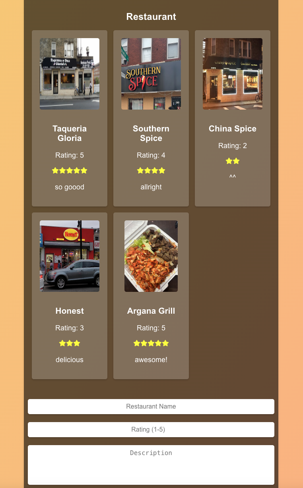

# ReactFoodie
# Restaurant Board Application

## Overview
The **Restaurant Board Application** allows users to:

1. Register an account.
2. Log in with their credentials.
3. Post ratings for restaurants, including a brief review.

The application is built with a backend using **Node.js**, **Express**, and a **MySQL** database. The front-end is developed using **React**, providing an intuitive and user-friendly interface.

---

## Features

### User Authentication
- **Register**: New users can create an account by providing a username and password.
- **Login**: Registered users can log in to access the app's features.

### Restaurant Rating
- **Post a Rating**: Users can rate restaurants on a scale of 1-5 stars and optionally leave a review.
- **View Ratings**: All ratings for a restaurant are displayed, showing user reviews and average ratings.

---

---

## Preview


---
## Installation and Setup

### Prerequisites
- Node.js (v14 or later)
- MySQL
- npm or yarn

### Backend Setup
Set up the database:
   - Create a MySQL database named `restaurant_board`.
   - Run the following SQL script to create the necessary tables:
     ```sql
     CREATE DATABASE restaurant_board;
     
     USE restaurant_board;

     CREATE TABLE users (
         id INT AUTO_INCREMENT PRIMARY KEY,
         name VARCHAR(255) NOT NULL,
         password VARCHAR(255) NOT NULL
     );

     CREATE TABLE products (
         id INT AUTO_INCREMENT PRIMARY KEY,
         user_id INT NOT NULL,
         restaurant_name VARCHAR(255) NOT NULL,
         rating INT NOT NULL,
         review TEXT,
         FOREIGN KEY (user_id) REFERENCES users(id)
     );
     ```

---

## API Endpoints

### User Authentication
- **Register**:
  - **Method**: POST
  - **Endpoint**: `/register`
  - **Body**:
    ```json
    {
      "name": "exampleuser",
      "password": "examplepassword"
    }
    ```

- **Login**:
  - **Method**: POST
  - **Endpoint**: `/login`
  - **Body**:
    ```json
    {
      "name": "exampleuser",
      "password": "examplepassword"
    }
    ```

### Post Rating
- **Method**: POST
- **Endpoint**: `/products`
- **Body**:
  ```json
  {
    "restaurant_name": "Restaurant ABC",
    "rating": 5,
    "review": "Excellent food and service!"
  }
  ```

### Get Ratings for a Restaurant
- **Method**: GET
- **Endpoint**: `/products`

---

## Project Structure
```
restaurant-board/
├── server/             # Backend application
│   ├── index.js          # Main application file
│   ├── routes/         # API routes
│   └── models/         # Database models
├── client/             # Frontend application
│   ├── src/
│   │   ├── pages/      # Page components
│   │   └── App.js      # Main React application file
├── .env                # Environment variables
├── package.json        # Dependencies and scripts
└── README.md           # Documentation
```

---
